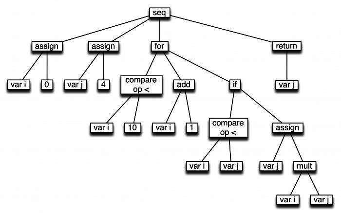

# chapter 10: compiler I: syntax analysis
A typical compiler consists of two pieces of functionality:

  * syntax analysis
  * code generation

Syntax analysis is the processing of converting user input (raw source code) into a data structure that the compiler
can then operate on, and consists of two steps:

  * *tokenization*, *lexical analysis*, or *scanning*, which groups individual sequential characters in the input into
    logical *atoms* (*which* characters is specified by the language spec.). Tokens can be identifiers, operators, etc.
  * *parsing*, which maps the *tokens* created by tokenization onto language constructs: variables, functions, classes,
    etc. using a grammar.

A *formal language* is a language with a strict structural definition. Programming languages are formal languages that
frequently rely on *context-free grammars*. A grammar specifies how tokens can be grouped into logical units; for
instance, `count`, `<=`, and `100` in a certain language might be grouped into an "expression", or `count <= 100`.
Tokens are **terminals**, meaning they can't be decomposed any further, while combinations of tokens are
**non-terminals**. Grammars are highly recursive.

Parsing, then, is the process of both **validating** and **decomposing** user input into a *parse tree*. One method of
parsing text is top-down *recursive descent*, which basically instructs that you keep `parse()`ing **non-terminals**
until you recurse all the way down to **terminals** alone.

Here's an example of an *abstract syntax tree* recursively generated for an example language:

**LL(1)** grammars describe languages that can be parsed with a maximum of 1 token per look-ahead; in other words, a
single token is sufficient to deduce what logical collection the next tokens will compose. In *Jack*, language
constructs are uniquely identified by tokens like `let`, `function`, `var`, `method`, etc., meaning that it's almost
exactly an **LL(1)** grammar.
