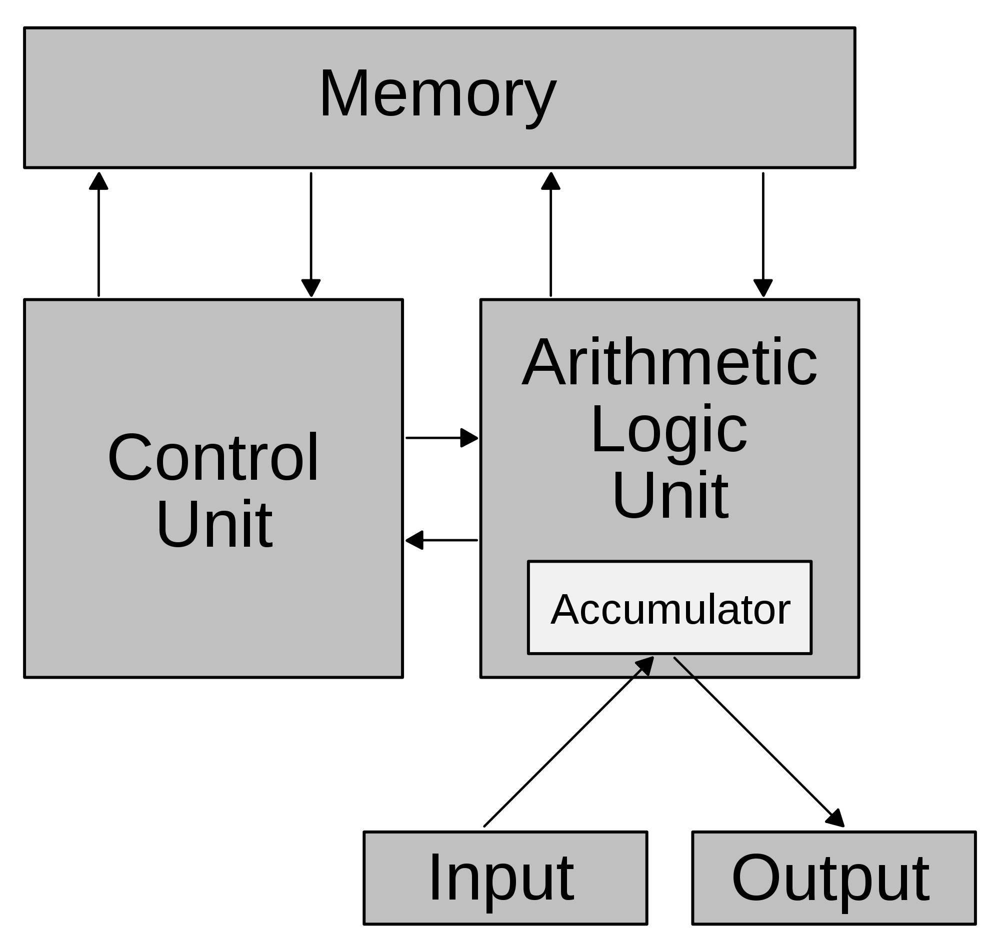

# chapter 5: computer architecture

*stored program*: formulated independently by several mathematicians in the 1930s. Programs are stored in memory, just
like data.

### computer models: *von Neumann architecture*

*computer models* include the primarily theoretical *universal Turing machine* (1936), and the *von Neumann machine*
(1945), which serves as a practical blueprint of contemporary computers.

Contains:

  * **CPU**, which interacts with a:
  * **memory device**, which receives input from an:
  * **input device**. The **CPU** then sends data to an:
  * **output device**.

## memory
There are two types of memory:

  * **Data memory**: high-level data abstractions are stored as binary strings down in memory; *data memory* can be
   read from and written to.
  * **Instruction memory**: high-level language statements are compiled down to assembly, and then assembled to binary
   machine instructions. The CPU fetches instructions from *instruction memory* and then executes them.

## CPU
The *CPU* consists of:

  * **ALU**: performs all math/logic operations.
  * **registers**: high-speed access storage; an alternative to *RAM* (data memory).
  * **Control Unit**, which:
   1. decodes machine instructions and executes them
   2. figures out which instruction should be executed next

## registers
Registers provide an incredibly fast-access storage alternative to RAM, because:

  * they're physically located *inside* the CPU, meaning that data-transfers are nearly instantaneous
  * there's only a handful of registers, meaning they can be uniquely identified with a small number of bits. This
   enables a more lightweight instruction format.

The three types of registers are:

  * **data registers**: used to store intermediate values in operations. For instance:
   `(a - b) * c` requires that `(a - b)` be calculated and stored in a register, which is then multiplied into `c`.
  * **addressing registers**: store memory addresses, which are used to access values in memory (RAM).
  * **Program Counter**: the CPU has to keep track of the next instruction to execute. This value is stored in the
   *program counter*, or *PC*.

## input/output
All *I/O* devices have different architectures and are abstracted away with *memory mapped I/O*, which allocates
segments of RAM for each of them. The relationships between device types and their memory segments:

 device type |   memory segment
 ----------- | ------------------
    input    | reflects its state
   output    | dictates its state
